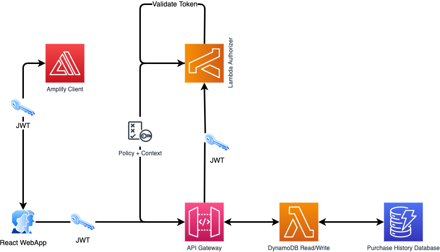

# AWS Authorization and Authentication Tutorial

For new developers, it is not immediately obvious that there is a difference between the terms Authorization and Authentication. Although related, these terms actually refer to two different concepts. Authentication determines if the login credentials provided by a user are allowed to enter the system while authorization determines what a user is allowed to access once they have been authenticated. In short, authentication is about who is allowed in and authorization is about what they are allowed to access. AWS offers a service called Amazon Cognito for both scenarios.

In this write up I'll demonstrate how one might go about using Cognito to develop the authentication and authorization layer of a web app that tracks purchases for multiple users.

## Background Knowledge

### JSON Web Tokens

A JSON Web Token, JWT, is an open standard that is widely used to securely share authentication information (claims) between a client and a server. The standard is defined in the RFC7519 specification developed by the Internet Engineering Taskforce (IETF). JWTs are signed using cryptography algorithms in order to provide the assurance of integrity by providing a means to detect post creation modification. In addition, JWTs can also be encrypted in order to prevent unauthorized access.

A JSON Web token contains three sections.

1. Header
2. Payload
3. Signature

The three sections are encoded as base64url string that are separated by dot characters in order to assume the following form.

```
<Header>.<Payload>.<Signature>
```

### Cognito JWTs

AWS has adopted and adapted the RFC7519 standard for use with the cognito service.
When a user successfully authenticates with cognito, cognito creates a session before responding to the authentication request with (3) JWTs - access token, id token and refresh token.
These tokens can be used to grant access to server-side resources or to the Amazon API Gateway. Alternatively they can be exchanged for temporary AWS credentials in order to access other AWS services.

Let's take a closer look at the cognito JWTs mentioned above.

### ID Token

An ID token is a JWT that contains claims related to the identity of the authenticated user i.e email, phone number and custom attributes. When used to authenticate users of a web app, the signature of the token must be verified before the claims stored in the token can be trusted.

### Access Token

An access token is a JWT that contains claims related to the authenticated user's groups and scopes. Access tokens are similar to id tokens with very few exceptions. For example ID tokens allow the use of custom attributes whereas access tokens do not. To get a full understanding of what an access token is and how it differs from an id token refer to the the following resources.

- [using access tokens](https://docs.aws.amazon.com/cognito/latest/developerguide/amazon-cognito-user-pools-using-the-access-token.html)

- [using id tokens](https://docs.aws.amazon.com/cognito/latest/developerguide/amazon-cognito-user-pools-using-the-id-token.html)

### Refresh Token

A refresh token is used to retrieve new access tokens. Refresh tokens have a default expiration of 30 days after a user signs into the designated userpool. This can be manually configured while creating an app for the userpool. When a refresh token expires, the the user must re-authenticate by signing in again.

## Lambda Authorizer

Lambda Authorizers are custom lambdas that verify claims contained within JWTs. When a request is received by an API gateway instance that is configured to use a lambda authorizer for authorization purposes, the bearer token contained in the request header is forwarded to the lambda authorizer for verification. Once a token is verified, the lambda authorizer should return an output that assumes the following format.

- The principalId is the user id associated with the token sent by the client.
- If the API uses a usage plan and the apiKeySource is set to AUTHORIZER, the lambda authorizer output must include the usage plan's API keys as the `usageIdentifierKey` property value

```
{
  "principalId": "yyyyyyyy", // The principal user identification associated with the token sent by the client.
  "policyDocument": {
    "Version": "2012-10-17",
    "Statement": [
      {
        "Action": "execute-api:Invoke",
        "Effect": "<Allow|Deny>",
        "Resource": "<aws resource>"
      }
    ]
  },
  "context": {
    "key": "value",
  },
  "usageIdentifierKey": "{api-key}"
}
```

### Verifying tokens

Token verification is done in 3 steps.

1. Verify structure of token
2. Verify signature
3. Verify the claims

#### Verify structure of token

Confirm that the token contains three dot separated base64url strings. If the token does not conform to this structure then it is invalid.
The first string is a header string followed by a payload string and then finally the signature string as shown below.

```
<Header>.<Payload>.<Signature>
```

#### Verify signature

###### Decode token

To validate the JWT signature, the token must first be decoded.

###### compare local key ID (kid) to public key ID

i. Download and store JWK, (JSON Web Key) for your user pool using the following url  
 `https://cognito-idp.{region}.amazonaws.com/{userPoolId}/.well-known/jwks.json`
substitute region and userPoolId with your user pool's region and user pool Id respectively `

ii. Search the downloaded `JWK` for a `kid` that matches the `kid` of your `JWT`

###### compare signature of the issuer to the signature of the tokens

#### Verify the claims

## Scenario: Multi-tenant purchase tracking microservice

Imagine you are a software engineer who works at a company that has just won a contract to develop an e-commerce web application.
You have been tasked with developing the authorization and authentication layer of the Web App's backend.
Your team's solutions architect has provided the following architecture to help you visualize how the authorization and authentication layer might look.
She has also asked you to write validation tests to prove that your implementation works as expected.


1. Users authenticate with a username and password, the web app passes these to amazon cognito for validation.
2. If the supplied credentials (username and password) are valid, cognito creates a session and subsequently issues three (3) JWTs (JSON Web Tokens). The aforementioned tokens are id token, access token and a refresh token. The authenticated user can now send requests to api gateway along with with the id token in the headers section.
3. API gateway sends the received id token to a lambda function called an authorizer.
4. The authorizer function verifies the claims attached to the id token.
5. The authorizer returns a policy and context.
6. API Gateway evaluates the policy and forwards the request to a lambda function along with the authorizer generated context.
7. The lambda function writes/reads data according to the tenantId listed in the forwarded context.
8. A response is returned by the lambda function.
